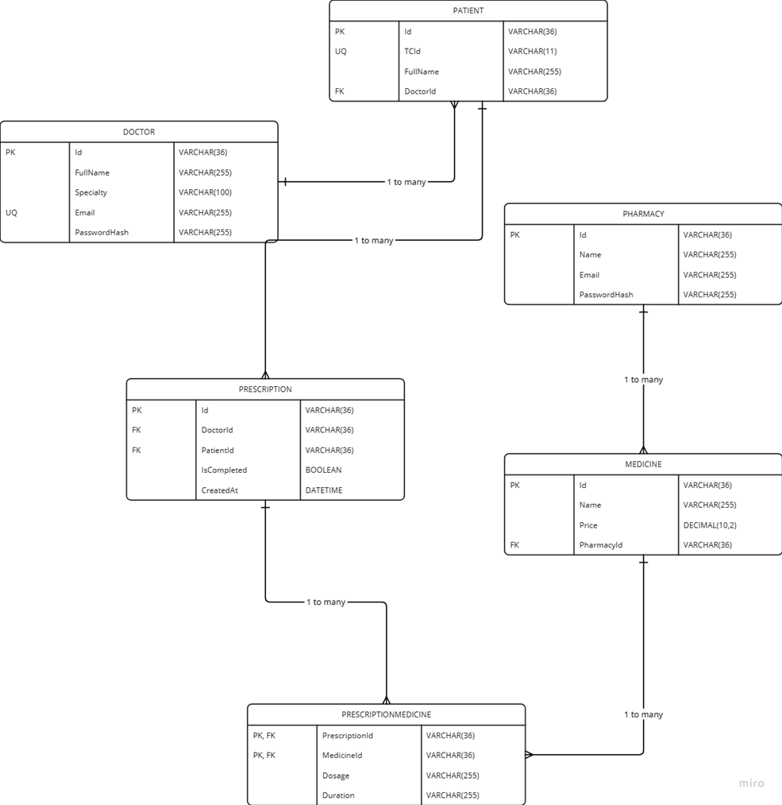

# Doctor Appointment System

## Proje Açıklaması
Doctor Appointment System, doktorlar, hastalar ve eczacılar arasında reçete yönetimini kolaylaştıran bir sistemdir. Bu proje Blazor WebAssembly ve .NET 8 kullanılarak geliştirilmiştir.
### ** video link**
-https://youtu.be/hX6CDkNF5V8
## Kullanılan Teknolojiler
- **Blazor WebAssembly (WASM)** - Etkileşimli web arayüzü oluşturmak için kullanılır.
- **ASP.NET Core** - Kimlik doğrulama ve iş mantığını yöneten backend API.
- **MongoDB** - NoSQL veritabanı, doktorlar, hastalar, reçeteler ve eczaneleri depolar.
- **Redis** - Cache mekanizması olarak kullanılır.
- **RabbitMQ** - Mesaj kuyruğu yönetimi sağlar.
- **JWT Authentication** - Doktorlar ve eczacılar için güvenli kimlik doğrulama.
- **Swagger UI** - API dokümantasyonu sağlar.

## Proje Modülleri
### **DoctorAppointmentSystem.API**
- API işlemlerini yönetir.
- MongoDB ile veritabanı yönetimi sağlar.
- Redis ile caching yapar.
- RabbitMQ mesaj kuyruğunu kullanır.
- Swagger ile API dokümantasyonu sunar.

### **DoctorAppointmentSystem.Blazor**
- Kullanıcı arayüzü için Blazor WebAssembly kullanır.
- **Blazored.LocalStorage** ile tarayıcıda veri saklar.
- **Blazored.Toast** ile bildirim mesajları gösterir.
- **HttpClient** ile API çağrılarını yönetir.
- Doktorlar ve eczacılar için giriş işlemlerini yönetir.

### **DoctorAppointmentSystem.Model**
- Projede kullanılan veri modellerini içerir.
- **MongoDB.Bson** bağımlılığı ile veritabanı işlemlerini yönetir.

### **DoctorAppointmentSystem.Service**
- API ve Blazor istemcisi arasındaki iş mantığını yönetir.
- Eczane ve doktor hizmetlerini sağlar.

### **DoctorAppointmentSystem.EmailWorkerService**
- RabbitMQ üzerinden gelen mesajları dinler.
- Reçetesi eksik olan hastalara e-posta bildirimi gönderir.
- **Newtonsoft.Json** ile mesajları işler.

### **DoctorAppointmentSystem.WorkerService**
- Arka planda rutin işlemleri gerçekleştirir.
- **HtmlAgilityPack** ile HTML verisi işler.
- **DocumentFormat.OpenXml** ile OpenXML formatında belge oluşturur.

## ER Diagram Representation


## Kurulum
1. **Bağımlılıkları yükleyin:**
   ```sh
   dotnet restore
   ```
2. **Veritabanı bağlantılarını yapılandırın:**
   - `appsettings.json` dosyasındaki MongoDB, Redis ve RabbitMQ bağlantı bilgilerini düzenleyin.
3. **API'yi çalıştırın:**
   ```sh
   dotnet run --project DoctorAppointmentSystem.API
   ```
4. **Blazor istemcisini çalıştırın:**
   ```sh
   dotnet run --project DoctorAppointmentSystem.Blazor
   ```
5. **Worker servislerini başlatın:**
   ```sh
   dotnet run --project DoctorAppointmentSystem.EmailWorkerService
   dotnet run --project DoctorAppointmentSystem.WorkerService
   ```

## API Kullanımı
API endpointlerini görmek için Swagger arayüzüne erişebilirsiniz:
```sh
http://localhost:5000/swagger/index.html
```

